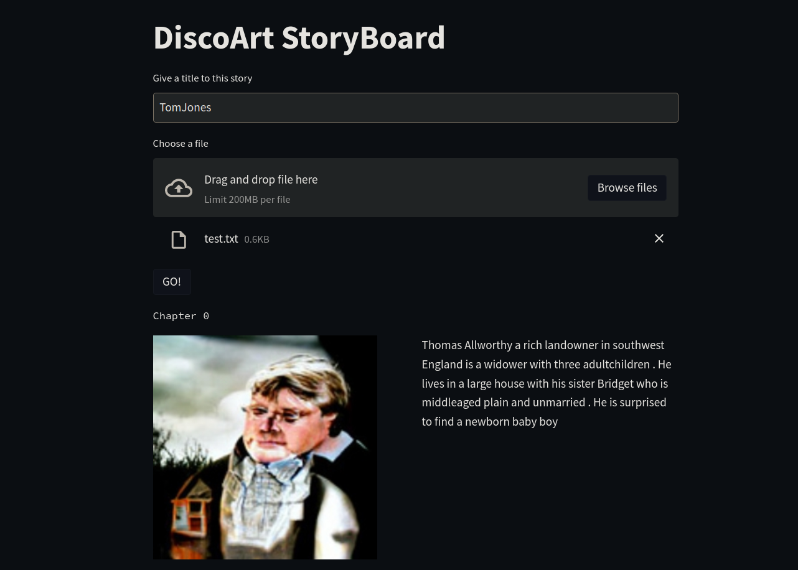

# Discoart-StoryBoard

Thanks to [Jina AI](https://duckduckgo.com) for providing the beautiful [DiscoArt](https://github.com/jina-ai/discoart), which is a very cutting edge technology for generative art. 

This project is a PoC for a webservice that provides a simple way to create images giving very long texts.
Thanks to [Distillbart](https://huggingface.co/sshleifer/distilbart-cnn-12-6) model, it is possible summarize book's chapters, without losing the main themes in it.
Giving this summary as an input to Discoart, the final result is impressive.




## Requirements

Few requirements are needed :

- Install the [requirements.txt](requirements.txt)
- Having a GPU on your laptop/PC/Server/EC2 (I run this on a 3060 laptop GPU, so the values in [da_client.py](da_client.py) works for GPU with specs >= of mine)
- Correcly install torch, I think that the best way is visit the [official page](https://pytorch.org/get-started/locally/), choose your setup and than copy paste the right command

## Run the streamlit app

I think that for PoC or ML projects [Streamlit](https://streamlit.io/) is a game changer, I use it every time I can :)

So, to launch the streamlit app just:

```console
streamlit run main.py
```

## Serve Discoart 

Serving Discoart is very simple, the command is: 

```console
python -m discoart serve [flow.yml](flow.yml)
```
I used a custom flow.yml just to specify a different protocol; I use `grpc` not `http` which is set by default. 


## How it works

It takes as input the name of the story; it is needed just to label the images.

Then a `.txt` file, to separate each chapter use `!!!`.

It runs in serial, each chapter is processed one by one. With my parameters, each image take 2 minutes more or less. Clearly all depends from available resources and from the parameters you choose.

After it runs, an image and the summary used as input will pop up.


## Have fun !

Automatically, streamlit opens your browser and you are ready to use this WoW-application. At first time you start the service, it takes ~30-40 sec to load the `bert` model, than it is ready to go!

> :warning: **THIS IS A PROOF OF CONCEPT**

This is just a proof of concept, written in a couple of hours; I would spend few more hours to adding more feature, containerized it and improve its usability

